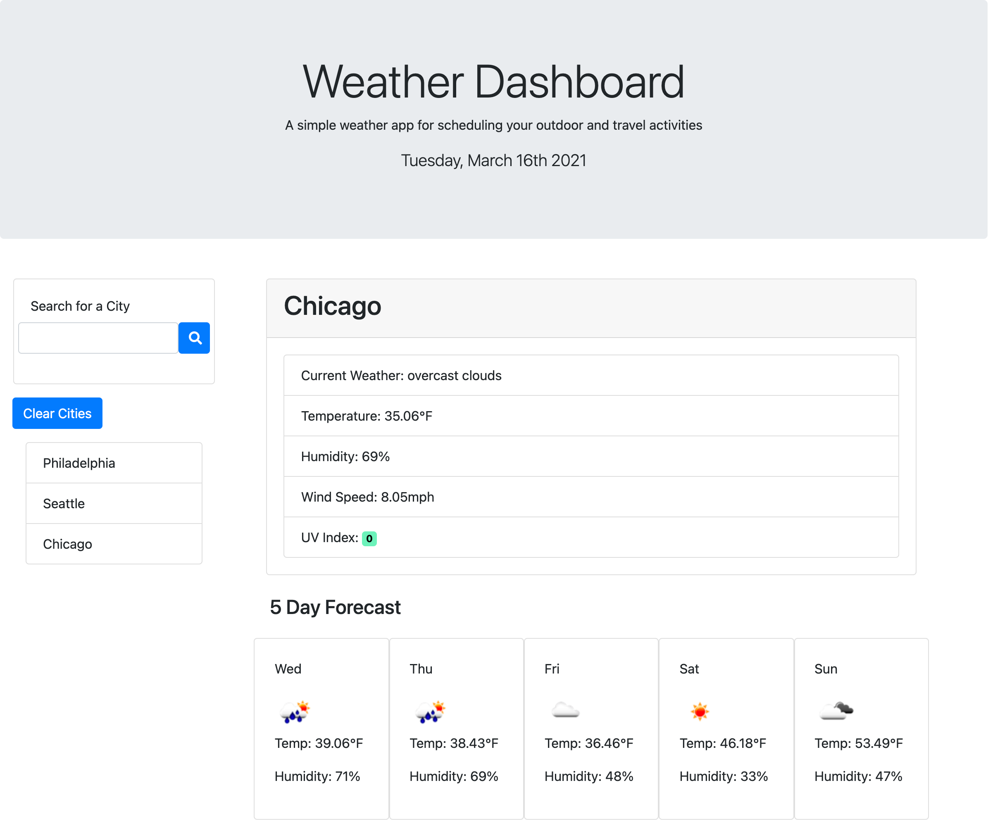

# weather-dashboard

## Description
This application is a simple weather display dashboard for scheduling your outdoor and travel activities. The user can input the city name of the weather they'd like to see, including the current weather and a 5 day forecast.
This application runs in the browser and features dynamically updated HTML and CSS powered by Javascript and jQuery. Weather data is retrived by making `fetch()` calls to the [Open Weather API](https://openweathermap.org/api). Date/Time elements are displayed using [Moment.JS](https://momentjs.com/).

### Functional Elements:
* When the page loads, a search box is displayed. The date is displayed in the header using Moment.JS.
* When a city name is typed and the search button is clicked,
    * the current weather is displayed.
    * a five day forecast is displayed.
    * the city name is added to `localStorage`.
    * the city name appends as a list item to the lefthand side of the page.
    * the city name clears from the search box.
* The current weather displays: the city name, the weather conditions, the temperature, the humidity, the wind speed, and the UV index.
    * The UV Index is shown in a box with color that indicates whether the conditions are low, medium, high, very high, or extremely high.
* The 5-Day Forecast weather displays: the day of the week, an icon representation of weather conditions, the temperature, and the humidity
* When one of the cities in the search history list is clicked, the current and future weather is displayed for that city.
* Upon refreshing the page, the previous search history is displayed on the page based on the cities saved in `localStorage`.

### Issues
* The 5-day forecast boxes only squeeze smaller and do not adapt to smaller screens.
* In general, the css needs to be updated with media queries and additional bootstrap classes to adapt to smaller screens.
* The search box only works with clicks and does not work if the enter button is pressed after typing the city name.
* Card borders for dynamically generated elements are showing the empty boxes prior to clicking the search button.

## Usage
Deployed link to live site can be found at: https://suejinkim20.github.io/weather-dashboard/

The page has the following appearance:

## Credits

* Tutorials used:
    * https://www.w3schools.com/js/default.asp
    * https://developer.mozilla.org/en-US/docs/Web/JavaScript
    * https://www.w3schools.com/jquery/
    * https://momentjs.com/
    * https://api.jquery.com/
    * https://openweathermap.org/api

## License

MIT License

Copyright (c) [2021] [Sue Jin Kim]

Permission is hereby granted, free of charge, to any person obtaining a copy of this software and associated documentation files (the "Software"), to deal in the Software without restriction, including without limitation the rights to use, copy, modify, merge, publish, distribute, sublicense, and/or sell copies of the Software, and to permit persons to whom the Software is furnished to do so, subject to the following conditions:

The above copyright notice and this permission notice shall be included in all copies or substantial portions of the Software.

THE SOFTWARE IS PROVIDED "AS IS", WITHOUT WARRANTY OF ANY KIND, EXPRESS OR IMPLIED, INCLUDING BUT NOT LIMITED TO THE WARRANTIES OF MERCHANTABILITY, FITNESS FOR A PARTICULAR PURPOSE AND NONINFRINGEMENT. IN NO EVENT SHALL THE AUTHORS OR COPYRIGHT HOLDERS BE LIABLE FOR ANY CLAIM, DAMAGES OR OTHER LIABILITY, WHETHER IN AN ACTION OF CONTRACT, TORT OR OTHERWISE, ARISING FROM, OUT OF OR IN CONNECTION WITH THE SOFTWARE OR THE USE OR OTHER DEALINGS IN THE SOFTWARE.